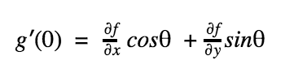
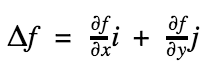

:toc: macro
toc::[]

= *ÇOK BOYUTLU KISITLAMASIZ OPTİMİZASYON* +
== *DOĞRUDAN YÖNTEMLER* +
== *GRADYEN YÖNTEMLERİ* +
Adından da anlaşılacağı gibi, *gradyen yöntemleri*, optimumu belirleyen etkili algoritmalar üretmek için türev bilgilerini doğrudan kullanır. En hızlı artan veya en hızlı azalan yön olarak da adlandırılır. İlk adım olarak bir başlangıç noktası seçilir ve amaç fonksiyonunu en hızlı geliştiren yönde hareket edilir. 

=== *Gradyenler ve Hessianlar* +
Bir boyutlu fonksiyonun birinci türevi, diferansiyeli alınan fonksiyonun eğilimini veya o noktadaki teğetini ifade eder.

 Örneğin; eğimin pozitif olması, bağımsız değişkeni artırmanın incelenen fonksiyonun değerini artıracağı 
 anlamındadır. 
 
 Ayrıca birinci türev fonksiyonun optimum bir noktasına ne zaman erişeceğini de ifade eder, türevin sıfıra 
 gittiği nokta.

*Gradyen* +
İki boyutlu bir _f(x,y)_ fonksiyonunu ele alalım ve bu fonksiyonun bir dağın üzerindeki konumumuzu temsil ettiğini varsayalım. Dağın üzerinde belirli bir _(a,b)_ konumunda olduğunuzu düşünelim. Herhangi bir doğrultudaki eğim; yönü belirtmenin bir yolu, yöne bağlı gradyen x ekseni ile _θ_ açısı yapan  bir _h_ ekseni boyunca tanımlanır. Bu yeni eksen boyunca yükseklik yeni bir _g(h)_ fonksiyonu olarak düşünülebilir. Eğer konumunuzu bu eksenin başlangıcı olarak tanımlarsanız _(yani h=0)_, bu yöndeki eğim _g'(0)_ olacaktır. Yöne bağlı türev adı verilen bu eğim x ve y eksenleri boyunca alınan kısmi türevlerle hesaplanabilir.

Burada kısmi türevler _x=a_ ve _y=b_ noktalarında hesaplanmıştır. Amacımız, bir sonraki adımda en fazla yükseltiyi sağlamak olduğundan; *_"En dik çıkış hangi yöndedir ?"_* sorusuna yanıt bulmamız gerekir. 

Gradyen (Del f olarak da adlandırılan vektör)  yukarıdaki şekildeki gibi ifade edilir. _f(x,y)_ fonksiyonunun _x=a_ ve _y=b_ noktasındaki yöne bağlı türevini ifade eder. +

 *Gradyeni nasıl kullanırız?* Dağa tırmanma problemi için, eğer en hızlı şekilde yükseklik kazanmak istiyorsak, gradyen bize yerel olarak hangi yönde ilerlememiz gerektiğini ve bu yönde gidersek ne kadar kazanacağımızı söyler. Ancak bu stratejinin bizi her zaman doğrudan zirveye ulaştırmayacağını unutmamalıyız.
